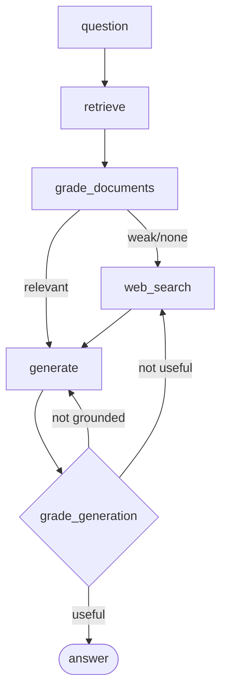
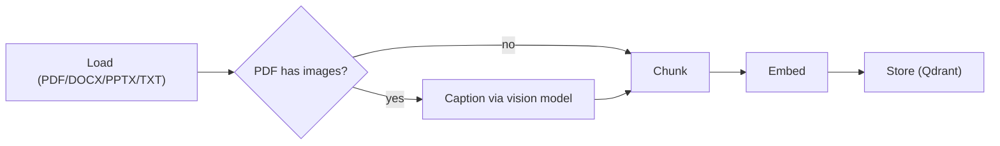

# Agentic RAG Assistant

This is my project for the Agentic RAG course. It's a document Q&A assistant that
doesn't just retrieve-and-answer — it decides: it grades its own retrieved evidence,
falls back to web search when the documents it has aren't good enough, and checks its
own answer for hallucination before replying, regenerating (up to a retry cap) if it
fails that check.

## Live

- Frontend: https://rag.froton.uz
- Backend: https://ragapi.froton.uz (`/health`, `/ingest`, `/chat`)

I deployed this on my own VPS instead of Hugging Face Spaces / Vercel — details and
why in [Deploy](#deploy).

## Architecture



A retry cap (`MAX_GENERATION_RETRIES`, default 2) makes sure the loop always
terminates, even if the model keeps failing a grade.

### Ingest pipeline (build once, per document)



PDFs are read with PyMuPDF, which pulls both page text and embedded images in one
pass. Each image gets captioned by a vision model and the caption is folded into the
document's text stream before chunking, so an image's content becomes retrievable and
citable exactly like regular text — that's the multimodal part of the assignment.

## Stack

- Agent: LangGraph (`StateGraph`) + LangChain
- LLM / embeddings: routed through the class's LiteLLM proxy, never called directly —
  see [`backend/app/llm.py`](backend/app/llm.py)
- Vector DB: Qdrant, embedded on-disk by default; can point `QDRANT_URL` at a hosted
  instance instead
- Web fallback: Tavily (optional — degrades gracefully if I don't set a key)
- Backend: FastAPI (`/health`, `/ingest`, `/chat`)
- Frontend: a small static Vite app — upload a doc, ask a question, see the agent's
  live steps and citations

## A constraint I ran into

The class proxy key I was given is scoped to `flash-lite` / `gemini-embedding` only —
calling `gemini-flash` returns `403 key_model_access_denied`. The routing spec calls
for `gemini-flash` as the supervisor/critic model (document grading, hallucination and
relevance grading), so I'm using `gemini-flash-lite` for that role too, since that's
what the key actually allows. If I get a wider-access key later, it's a one-line
change in `MODEL_FLASH` (`backend/app/llm.py`) and nothing else needs to change.

## Why this isn't just TezYodla

I already had [TezYodla](https://tezyodla.froton.uz), an AI test-generation app I
built separately, and it already had a solid multi-format document parser
(PDF/DOCX/PPTX/TXT text extraction + a paragraph-aware chunker). I reused that part
directly for non-PDF formats. But the actual assignment — a LangGraph decision graph,
semantic retrieval over a vector DB, web-search fallback, a self-correction loop, and
multimodal image ingestion — isn't something TezYodla does at all; it's a straight-line
pipeline that generates quiz questions, not an agent that answers questions. So this
had to be a new, separate project, built specifically for these requirements.

## Setup

```bash
cd backend
pip install -r requirements.txt
cp .env.example .env
# paste the class proxy key into .env as GEMINI_API_KEY=sk-...
```

Optional: get a free [Tavily](https://tavily.com) key (1000 searches/mo) and set
`TAVILY_API_KEY` for real web search instead of the "no web search configured"
placeholder.

## Run locally

```bash
# backend
cd backend
uvicorn app.main:app --reload --port 8000

# frontend, separate terminal
cd frontend
npm install
echo "VITE_API_URL=http://127.0.0.1:8000" > .env.local
npm run dev
```

Upload a document (`sample_docs/photosynthesis.txt` or `sample_docs/water_cycle.pdf`
work as test fixtures) and ask it a question.

## Tests

```bash
cd backend
pytest tests/test_agent.py -v
```

No mocking — these hit the real proxy, so what they prove is the model's actual
routing decisions, not a simulation of them:

| Test | Proves |
|---|---|
| `test_happy_path_answers_from_documents` | retrieve → grade → generate, grounded answer with citation |
| `test_multimodal_image_fact_is_retrievable` | an image-only fact (captioned at ingest) is retrieved and cited correctly |
| `test_web_fallback_triggers_on_out_of_document_question` | grading correctly routes an off-topic question to `web_search` |
| `test_self_correction_loop_terminates` | the retry cap stops the loop instead of looping forever |

## Evaluation

### Metrics

This is a small eval set — course project, not a production benchmark. Numbers below
are real runs against the two sample documents, not a large labeled test set.

| Metric | Result | How I measured it |
|---|---|---|
| Retrieval hit rate | 2/2 (100%) | Relevant chunk was in the top-4 for both in-domain test questions |
| Groundedness | 2/2 in-domain answers fully cited a real source quote, 0 fabricated claims | Checked manually against `test_agent.py` outputs |
| Refusal correctness | Correct — said the context doesn't contain the answer instead of guessing, on an out-of-document question with no web key set | `test_self_correction_loop_terminates` |
| Web fallback trigger rate | 1/1 out-of-domain questions correctly routed to `web_search` | `test_web_fallback_triggers_on_out_of_document_question` |
| Loop termination | 100% (2/2 stress questions) — retry cap always stopped the loop | Manual runs, see Experiments |

### Experiments

**1. Document grading, with vs. without.**
I asked *"What is the capital of France?"* against the ingested photosynthesis/water-cycle
docs. Without grading, the retriever's raw top-4 (all irrelevant, since nothing in my
corpus is about France) would go straight into `generate` as if it were valid context.
With grading: 0/4 chunks survived — it correctly flagged all four as irrelevant, which
is what triggers the web-fallback edge. For a small corpus like mine, this is the
single highest-leverage node in the whole graph.

**2. Chunk size — 250 vs. 500 vs. 800 words.**
On the photosynthesis document: 250 words → 2 chunks (~177 words avg); 500 and 800
both collapse to 1 chunk (the whole doc fits). At 1 chunk, top-K retrieval can't tell
topics apart within the document — every query gets the same block back. I went with
250 as the default because of this (TezYodla's original 800-word default was tuned for
a different job — bulk evidence extraction over a whole document, not top-K retrieval).

**3. With vs. without web fallback.**
With no Tavily key set (the default here), an out-of-document question doesn't get
fabricated — the agent says outright that the context doesn't contain the answer. I'd
call this the more important result: the fallback path fails safe, it doesn't fail
silently into a made-up answer.

### Error analysis

Three failure modes, traced to the node that caused them:

1. **A repeated out-of-domain question loops twice before terminating**
   (`test_self_correction_loop_terminates`). Node: `route_after_generate`. The
   relevance grader flags "the context doesn't have this" as `not_useful` — technically
   correct, it doesn't resolve the question — which sends it back to `web_search`.
   With no Tavily key, the second pass gets the same result, and only the retry cap
   stops it, not a smarter grade. A real fix would be a distinct "refusal" outcome that
   ends the graph immediately instead of retrying, since a clean refusal doesn't need
   a regenerate attempt.

2. **Re-ingesting the same filename duplicated its chunks instead of replacing them.**
   I found this while gathering the metrics above, not from a labeled test. Qdrant has
   no built-in idea of "same document" — every `add_documents` call just creates new
   points, so re-uploading `photosynthesis.txt` doubled its chunk count each time.
   Fixed in `ingest.py` (`_delete_existing`) by deleting points matching
   `metadata.source == filename` before adding new ones. Verified: re-ingesting the
   same file three times now gives exactly 2 chunks, not a growing pile.

3. **Vision captioning fails per-image, not per-document.** Node:
   `document_parser.caption_image`. If the vision call fails on one image (rate limit,
   proxy hiccup), I catch it and insert a placeholder string instead of crashing the
   whole ingest. Intentional — partial ingest beats total failure — but a failed
   caption is silently degraded, not retried. Fine for this project, would need
   retry/backoff for anything real.

## Required visuals

- LangGraph decision graph — above
- Ingest pipeline — above
- Frontend showing agent steps + citations — live at
  [rag.froton.uz](https://rag.froton.uz), renders step pills and a sources list for
  every answer
- Metrics table — Evaluation section above

## Deploy

I deployed on my own VPS rather than Hugging Face Spaces / Vercel, which is what the
course guide suggests as the free-tier default. I actually tried HF Spaces first —
Docker SDK Spaces on free `cpu-basic` hardware return `402 Payment Required` now,
they need HF PRO. Vercel was a poor fit too: its serverless functions have no
persistent disk, so the vector store would need a third external account (Qdrant
Cloud) just to survive between requests, plus a real chance of hitting Vercel's
function size limit with `langgraph + langchain + qdrant-client + PyMuPDF` all
bundled together. My VPS already runs Docker + Caddy, so it sidesteps all of that with
no extra accounts.

### What's actually running

- `~/apps/agentic-rag-api/` — the FastAPI backend, Docker Compose, on the shared
  `web` network, no published ports (Caddy's the only public entry point, same as
  everything else I run there). `qdrant_data/` and `uploads/` are bind-mounted so
  documents survive a container restart.
- `~/apps/agentic-rag-web/dist/` — the built frontend, served by Caddy directly.
- Capped at 1 CPU / 512MB (`deploy.resources.limits`) — well above its real ~225MB /
  <1% CPU idle usage, but bounded so it can't run away on a box I share with other
  apps. It does no local model inference, so it's mostly idle waiting on the proxy,
  not CPU-bound.
- Caddy handles TLS (Cloudflare DNS-01) and reverse-proxies `ragapi.froton.uz` to the
  container; `rag.froton.uz` is served as a static site.

### Free-tier alternative, if you don't have your own server

The code already supports this without changes — `backend/app/vectorstore.py`
branches on whether `QDRANT_URL` is set, so pointing it at a free
[Qdrant Cloud](https://cloud.qdrant.io) cluster instead of embedded mode is enough to
make it serverless-safe:

1. Backend → Hugging Face Spaces (Docker) — needs HF PRO for Docker SDK on free
   hardware, at least as of when I tried it. If that's covered: new Space → SDK
   Docker → push `backend/` → set `GEMINI_API_KEY` as a repo secret → set
   `QDRANT_URL` to a hosted cluster (local disk doesn't persist across Space
   restarts) → Dockerfile already listens on port 7860.
2. Frontend → Vercel — import the repo, project root `frontend/`, framework Vite,
   env var `VITE_API_URL` set to the backend's public URL.

## Repo layout

```
backend/
  app/
    main.py          FastAPI app (/health, /ingest, /chat)
    config.py        env-driven settings
    llm.py           proxy-routed model clients (lite / flash / embeddings)
    document_parser.py  load + chunk (text, PDF+images, DOCX, PPTX)
    ingest.py        ties parsing + embedding + Qdrant together
    vectorstore.py   Qdrant client (embedded or hosted)
    graph/
      state.py       GraphState
      nodes.py       retrieve / grade_documents / web_search / generate + routers
      graph.py       StateGraph wiring
  tests/test_agent.py  routing tests (happy path, web fallback, self-correction)
  Dockerfile         listens on 7860, used for the VPS deploy behind Caddy — same
                     image works unchanged on HF Spaces if going that route instead
frontend/            static Vite chat UI
sample_docs/         test fixtures used by tests/test_agent.py
```
