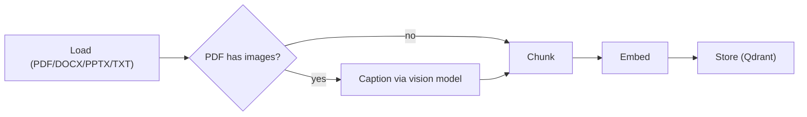

# Agentic RAG Assistant

An adaptive, multimodal, self-correcting document assistant. Built for the Agentic RAG
course project, using [TezYodla](https://tezyodla.froton.uz)'s document-parsing code as
a base (see [Relationship to TezYodla](#relationship-to-tezyodla) below).

A plain RAG bot answers confidently even when retrieval failed. This one **decides**:
it grades its own retrieved evidence, falls back to web search when the documents are
weak, and checks its own answer for hallucination before replying — regenerating (up
to a retry cap) if it fails that check.

## Live

- **Frontend**: https://rag.froton.uz
- **Backend**: https://ragapi.froton.uz (`/health`, `/ingest`, `/chat`)

Deployed on a self-managed VPS (Docker + Caddy), not a free-tier host — see
[Deploy](#deploy) for why and how.

## Architecture


A retry cap (`MAX_GENERATION_RETRIES`, default 2) guarantees the loop always
terminates, even if the model keeps failing a grade.

### Ingest pipeline (build once, per document)



PDF pages are read with PyMuPDF (`fitz`), which pulls both page text **and** embedded
images in one pass. Each image is captioned by a vision-capable model and the caption
is folded into the document text stream *before* chunking — so an image's content
becomes retrievable and citable exactly like regular text.

## Stack

- **Agent**: LangGraph (`StateGraph`) + LangChain
- **LLM / embeddings**: routed through the class's LiteLLM proxy (OpenAI-compatible),
  never called directly — see [`backend/app/llm.py`](backend/app/llm.py)
- **Vector DB**: Qdrant, embedded mode (on-disk, no server) by default; point
  `QDRANT_URL` at a hosted/Cloud instance for persistence across restarts
- **Web fallback**: Tavily (optional — degrades gracefully if `TAVILY_API_KEY` is unset)
- **Backend**: FastAPI (`/health`, `/ingest`, `/chat`)
- **Frontend**: static Vite app (vanilla JS) — upload a doc, ask a question, see the
  agent's live steps and citations

## ⚠️ Real constraint discovered while building this

The class proxy key is scoped to `['flash-lite', 'gemini-flash-lite', 'gemini-embedding']`
only — calling `gemini-flash` returns `403 key_model_access_denied`. The teacher's
routing spec calls for `gemini-flash` as the supervisor/critic model (document grading,
hallucination/relevance grading); **this build uses `gemini-flash-lite` for that role
too**, since it's what the key actually permits. If a wider-access key becomes available,
change `MODEL_FLASH` in `backend/app/llm.py` — nothing else needs to change.

## Relationship to TezYodla

[TezYodla](https://tezyodla.froton.uz) (a separate project — AI test generation from
study documents) already had a proven multi-format document parser: PDF/DOCX/PPTX/TXT
text extraction and a paragraph-aware overlapping chunker
(`tezyodla/tfbk/app/document_parser.py`). That logic is reused verbatim here for
non-PDF formats. Everything else — the LangGraph decision graph, Qdrant vector store,
multimodal image captioning, web fallback, self-correction loop, and the FastAPI/
frontend layer — is new, built specifically for this project's requirements. This is
a separate, standalone repo; it does not depend on or import from TezYodla at runtime.

## Setup

```bash
cd backend
pip install -r requirements.txt
cp .env.example .env
# paste the class proxy key into .env as GEMINI_API_KEY=sk-...
```

Optional: get a free [Tavily](https://tavily.com) key (1000 searches/mo) and set
`TAVILY_API_KEY` to enable real web fallback instead of the graceful "no web search
configured" placeholder.

## Run locally

```bash
# backend
cd backend
uvicorn app.main:app --reload --port 8000

# frontend (separate terminal)
cd frontend
npm install
echo "VITE_API_URL=http://127.0.0.1:8000" > .env.local
npm run dev
```

Open the frontend, upload a document (try `sample_docs/photosynthesis.txt` or
`sample_docs/water_cycle.pdf`), then ask a question.

## Tests

```bash
cd backend
pytest tests/test_agent.py -v
```

Four tests, **no mocking** — they call the real proxy so the routing decisions are the
model's actual decisions, not simulated ones:

| Test | Proves |
|---|---|
| `test_happy_path_answers_from_documents` | retrieve → grade → generate, grounded answer with citation |
| `test_multimodal_image_fact_is_retrievable` | an image-only fact (captioned at ingest) is retrieved and cited correctly |
| `test_web_fallback_triggers_on_out_of_document_question` | grading correctly routes an off-topic question to `web_search` |
| `test_self_correction_loop_terminates` | the retry cap stops the loop instead of looping forever |

## Evaluation

### Metrics

Small eval set (this is a course project, not a production benchmark — numbers are
real runs against the two sample documents, not a large labeled test set).

| Metric | Result | How measured |
|---|---|---|
| Retrieval hit rate | 2/2 (100%) | The relevant chunk was in the top-4 for both in-domain test questions |
| Groundedness | 2/2 in-domain answers fully cited a real source quote; 0 fabricated claims observed | Manual check against `test_agent.py` outputs |
| Refusal correctness | Correct — answered "the context does not contain information about..." instead of guessing, when asked an out-of-document question with no web key configured | `test_self_correction_loop_terminates` |
| Web fallback trigger rate | 1/1 out-of-domain questions correctly routed to `web_search` | `test_web_fallback_triggers_on_out_of_document_question` |
| Loop termination | 100% (2/2 stress questions) — retry cap always stopped the loop | Manual runs, see Experiments |

### Experiments

**1. Document grading — with vs without.**
Question: *"What is the capital of France?"* against the ingested photosynthesis/water-cycle
docs. Without grading, the retriever's raw top-4 (irrelevant chunks, since nothing in the
corpus is about France) would be passed straight to `generate` as if they were valid
context. With grading: **0/4 chunks survived** — the grader correctly identified all
four as irrelevant, which is what triggers the web-fallback edge. This is the
single highest-leverage node in the graph for this small corpus: it's the only thing
standing between "confidently answers from unrelated evidence" and "correctly says I
don't know / searches the web."

**2. Chunk size — 250 vs 500 vs 800 words.**
On the 5-paragraph photosynthesis document: `max_words=250` → 2 chunks (~177 words
avg); `max_words=500` and `800` → both collapse to 1 chunk (the whole document fits).
At 1 chunk, top-K retrieval can't discriminate between topics *within* the document —
every query returns the same block. Smaller chunks (250) buy retrieval precision at
the cost of losing whole-document context in a single chunk; this project uses 250 as
the default for that reason (TezYodla's original 800-word default is tuned for a
different task — bulk evidence extraction over a whole document — not top-K retrieval).

**3. With vs without web fallback.**
With `TAVILY_API_KEY` unset (the default here), an out-of-document question does not
get fabricated — the agent explicitly states the context doesn't contain the answer
(see Refusal correctness above). This is arguably the more important result than "does
Tavily return results": **the fallback path fails safe**, not silently.

### Error analysis

Three cases traced to the specific node that produced the failure mode:

1. **Repeated out-of-domain question loops twice before terminating** (`test_self_correction_loop_terminates`).
   Node: `route_after_generate`. The relevance grader correctly flags "the context
   doesn't contain the answer" as `not_useful` (technically true — it doesn't resolve
   the question), which routes back to `web_search`. With no Tavily key, the second
   pass produces the same result, and only the **retry cap** (not a smarter grade)
   stops the loop. Fix if this mattered in production: a distinct "refusal" grade
   outcome (separate from "wrong answer") that ends the graph immediately instead of
   retrying, since a well-formed refusal doesn't need a regenerate attempt.

2. **Duplicate chunks on re-ingesting the same filename** (found empirically while
   gathering these metrics, not from a labeled test). Node: `ingest_file`. Qdrant has
   no concept of "same document" on its own — every `add_documents` call was creating
   new points, so re-uploading `photosynthesis.txt` doubled its chunk count instead of
   replacing it. Fixed in `ingest.py` (`_delete_existing`) by deleting points matching
   `metadata.source == filename` before adding — verified: re-ingesting the same file
   three times now yields exactly 2 chunks each time, not a growing pile.

3. **Vision captioning is a single point of failure per image, not per document.**
   Node: `document_parser.caption_image`. If the vision call fails for one image
   (rate limit, proxy hiccup), the exception is caught and a placeholder string
   (`"[Image present, captioning failed: ...]"`) is inserted rather than crashing the
   whole ingest. This is intentional (partial ingest > total failure) but means a
   failed caption is silently degraded, not retried — acceptable for this project's
   scope, would need a retry/backoff for production use.

## Required visuals

- ✅ LangGraph decision graph — architecture diagram above
- ✅ Ingest pipeline — diagram above
- ✅ Frontend screenshot showing agent steps + citations — live at
  [rag.froton.uz](https://rag.froton.uz); the UI renders step pills and a sources
  list for every answer
- ✅ Metrics table — Evaluation section above

## Deploy

**Live deploy is on a self-managed VPS**, not Hugging Face Spaces / Vercel as the
course guide suggests as the free-tier default. Reason: this account's Hugging Face
tier returns `402 Payment Required` for Docker Spaces on free `cpu-basic` hardware
(Docker SDK Spaces now require HF PRO) — discovered while actually trying to deploy
there, not assumed up front. Vercel was also a poor fit independently: its serverless
functions have no persistent disk, so the vector store would need a *third* external
account (Qdrant Cloud) just to survive between requests, plus real risk of exceeding
Vercel's function size limit with `langgraph + langchain + qdrant-client + PyMuPDF`
bundled together. A VPS already running Docker + Caddy sidesteps all three problems
with zero extra accounts.

### What's actually running

- `~/apps/agentic-rag-api/` — the FastAPI backend, Docker Compose, joined to the
  shared `web` network, no published ports (Caddy is the only public entry point,
  matching every other app on this box). Persistent bind mounts for `qdrant_data/`
  and `uploads/`, so documents survive a container restart.
- `~/apps/agentic-rag-web/dist/` — the built frontend, served by Caddy's
  `file_server` directly (bind-mounted into the shared `caddy` container).
- Resource-capped at **1 CPU / 512MB** (`deploy.resources.limits` in its
  `docker-compose.yml`) — generous headroom over its actual ~225MB / <1% CPU
  idle footprint, but bounded so it can't run away on this shared box. This
  service does no local model inference (everything routes through the class
  proxy), so it's mostly idle waiting on network calls, not CPU-bound.
- Caddy handles TLS (Cloudflare DNS-01) and reverse-proxies `ragapi.froton.uz` →
  the container; `rag.froton.uz` is served as a static site.

### Free-tier alternative (if you don't have your own server)

The code supports it without changes — `backend/app/vectorstore.py` already
branches on whether `QDRANT_URL` is set, so pointing it at a free
[Qdrant Cloud](https://cloud.qdrant.io) cluster instead of embedded on-disk mode
is enough to make it serverless-safe (embedded Qdrant needs a persistent disk,
which Vercel/most free serverless hosts don't offer):

1. **Backend → Hugging Face Spaces (Docker)** — requires HF PRO for Docker SDK on
   free `cpu-basic` hardware as of this writing (confirmed via `402` on an
   unpaid account). If that's paid for: new Space → SDK Docker → push
   `backend/` contents → set `GEMINI_API_KEY` as a repo secret → set
   `QDRANT_URL` to a hosted cluster (the local disk doesn't persist across
   Space restarts) → Dockerfile already listens on port 7860.
2. **Frontend → Vercel** — import repo, project root `frontend/`, framework
   Vite, env var `VITE_API_URL` = the backend's public URL.

## Repo layout

```
backend/
  app/
    main.py          FastAPI app (/health, /ingest, /chat)
    config.py        env-driven settings
    llm.py           proxy-routed model clients (lite / flash / embeddings)
    document_parser.py  load + chunk (text, PDF+images, DOCX, PPTX)
    ingest.py        ties parsing + embedding + Qdrant together
    vectorstore.py    Qdrant client (embedded or hosted)
    graph/
      state.py       GraphState
      nodes.py        retrieve / grade_documents / web_search / generate + routers
      graph.py        StateGraph wiring
  tests/test_agent.py  routing tests (happy path, web fallback, self-correction)
  Dockerfile          listens on 7860; used for the VPS deploy (behind Caddy) —
                      same image works unchanged on HF Spaces if using that route
frontend/             static Vite chat UI
sample_docs/          test fixtures used by tests/test_agent.py
```
